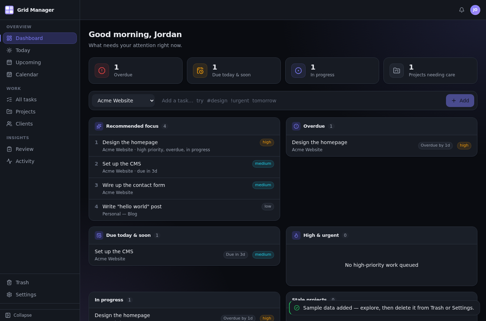
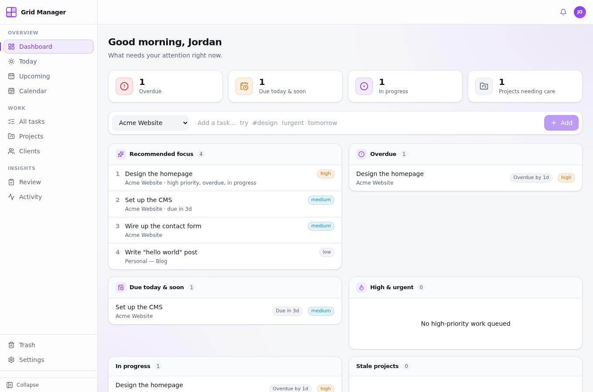
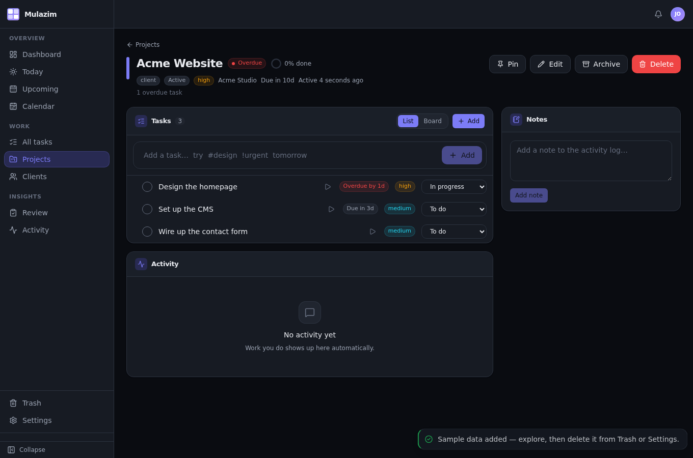
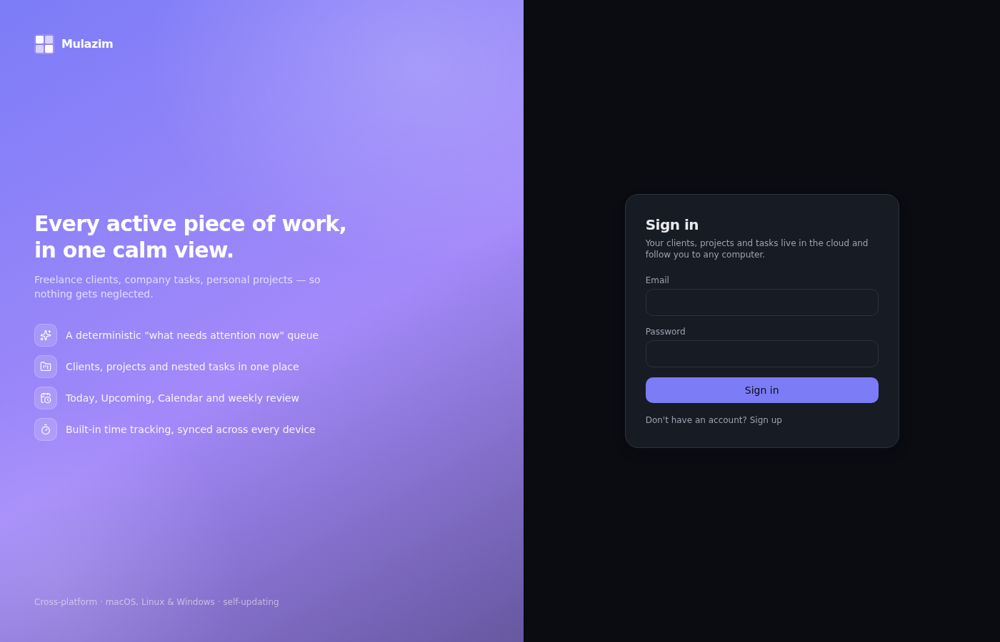

# Mulazim — open-source desktop project & task tracker

A free, cross-platform **desktop app for macOS, Linux and Windows** that keeps
every active piece of work in one place — freelance clients, company tasks,
personal side-projects — so nothing gets neglected.

Native app, not a browser tab: built with **Tauri 2** and **Rust**, a **React 19**
front end, and **Supabase** (Postgres) for sync, so your work follows you to any
computer you sign in from.

[](https://github.com/zimkk/mulazim/releases/latest)
[](./LICENSE)

## Download

### **[⬇ Get the latest release](https://github.com/zimkk/mulazim/releases/latest)**

Pick the file for your system — no build step, no toolchain, nothing to
configure. Create an account on first launch and your work syncs to every
device you sign in from.

| OS | Download | Notes |
|----|----------|-------|
| **Windows** | `*_x64-setup.exe` *(recommended)* | Installer lets you choose language, install for just you or everyone, the folder, and whether to add a desktop icon. WebView2 is bundled. |
| **Windows** *(alt)* | `*_x64_en-US.msi` | For managed/enterprise deployment. |
| **macOS** | `*_universal.dmg` | One build for Apple silicon and Intel. |
| **Linux — Debian/Ubuntu** | `*_amd64.deb` | `sudo apt install ./Mulazim*.deb` |
| **Linux — Fedora/RHEL** | `*.x86_64.rpm` | `sudo dnf install ./Mulazim*.rpm` |
| **Linux — anything else** | `*.AppImage` | `chmod +x` and run. |

Once installed the app checks for updates on launch and updates itself — you
only download manually this one time.

<details>
<summary><b>Seeing a security warning on first launch?</b></summary>

These builds are not yet signed with a paid code-signing certificate, so:

- **Windows** — SmartScreen says *"unknown publisher"*. Click **More info →
  Run anyway**.
- **macOS** — Gatekeeper blocks it. Right-click the app → **Open**, then
  confirm; or allow it under System Settings → Privacy & Security.

Both are the OS asking about the *certificate*, not about anything the app
does. See [`RELEASE.md`](./RELEASE.md) for what signing would involve.
</details>

## Screenshots

| Dashboard (dark) | Dashboard (light) |
|---|---|
|  |  |

| Project detail | Sign in |
|---|---|
|  |  |

## Features

- Dashboard with a deterministic "what needs attention now" queue, plus at-a-glance
  counters for overdue / due-soon / in-progress work
- Clients, projects (type / status / priority / deadline / health / review
  cadence), tasks (subtasks, tags, recurrence, start vs. due date, estimates)
- Views: Today, Upcoming, Calendar, All Tasks (filters + grouping + bulk edit),
  per-project Kanban board
- Plan-my-day, weekly review, project staleness detection
- Time tracking (start/stop timer, per-project report)
- Native + in-app notifications with quiet hours and a daily digest
- Command palette (⌘K), fully rebindable shortcuts
- Themes (light/dark/system), 6 accent colours, density & font-size controls
- Soft-delete + Trash, JSON/CSV/Markdown export, JSON import
- Self-updating; multi-device via a single cloud account

---

# Building from source

**You don't need any of this to use the app** — [download a
release](https://github.com/zimkk/mulazim/releases/latest) instead. Read on only
if you want to contribute, or run the app against your own Supabase backend.

Built with **Tauri 2 · Rust · React 19 · TypeScript · Tailwind CSS v4 · Motion ·
Zustand · TanStack Query · Supabase (Auth + Postgres + RLS)**.
See [`ARCHITECTURE.md`](./ARCHITECTURE.md) for the full design.

## Prerequisites

- Node.js 20+ and npm
- Rust (stable) — <https://rustup.rs>
- A [Supabase](https://supabase.com) project (free tier is fine)
- Linux only, for local desktop builds:
  ```bash
  sudo apt install libwebkit2gtk-4.1-dev libgtk-3-dev libayatana-appindicator3-dev librsvg2-dev patchelf build-essential
  ```

## Setup

```bash
npm install
cp .env.example .env      # fill in your Supabase URL + anon key (public values)
```

Apply the schema to your Supabase project — either run
`supabase link --project-ref <your-ref> && supabase db push`, or paste
`supabase/migrations/0001…0011` into the SQL editor in order. Optionally seed
sample rows with `supabase/seed.sql` (set the UID at the top first).

## Develop

```bash
npm run dev          # frontend in a browser (Supabase works; no native APIs)
npm run tauri dev    # full desktop app
npm run tauri build  # optimized binary + installer for the current OS
```

## Design system

The UI is built on CSS custom properties declared in Tailwind v4's `@theme`
block (`src/index.css`): a neutral scale, an accent ramp, semantic health
colours, and elevation/radius scales. Theme, accent, density and font size are
attributes on `<html>` (`.dark`, `data-accent`, `data-density`,
`data-font-size`), so a preference change restyles the whole app without a
re-render.

Animation lives in [`src/lib/motion.ts`](./src/lib/motion.ts) — shared spring and
easing presets for modals, toasts, the command palette and count-up figures.
Every animation is suppressed when the user enables *Reduce motion* or their OS
reports `prefers-reduced-motion`.

Motion is deliberately kept to bounded, one-shot cases. The app runs inside
WebKitGTK / WebView2, often on a software compositor, where `backdrop-filter`,
large gradients on a scroll container, per-row list animations and shared-layout
(`layoutId`) transitions are far more expensive than in Chromium — they made the
whole window feel laggy and are not used.

> **Note on Tailwind v4:** reference theme variables as
> `bg-[var(--color-accent)]`, never `bg-[--color-accent]`. The latter compiles to
> the literal `background-color: --color-accent`, which browsers discard
> silently — the class appears to work but paints nothing.

## Quality gates

```bash
npm run typecheck
npm run lint
npm run build
npm run test:e2e   # API round-trip against the Supabase project in .env
npm run test:ui    # headless-Chromium walk-through of the built app
npm run test:rls   # tenant-isolation audit: two users, every table, every verb
```

`test:rls` is the one to run after any schema change. It creates two accounts,
has one populate all 12 tables, then has the other attempt to read, update,
delete and spoof-insert every row — asserting that Row Level Security actually
holds rather than trusting the migration files.

`test:ui` needs a server running (`npm run build && npm run preview -- --port
4173`) and Chrome/Chromium at `/usr/bin/chromium` (override with `CHROME=`).

## Releasing

Tag-driven. Generate an updater key once
(`npm run tauri signer generate -- -w .secrets/updater.key`), put the public half
in `src-tauri/tauri.conf.json` → `plugins.updater.pubkey`, add the GitHub Actions
secrets, then `git tag vX.Y.Z && git push origin vX.Y.Z`. See
[`RELEASE.md`](./RELEASE.md).

## Layout

```
src/
  components/ui/   design-system primitives (Button, Card, Badge, Modal,
                   Stat, Progress, Kbd, Toolbar, States, …)
  components/      layout shell + feature components
  pages/           route screens
  lib/motion.ts    shared animation presets
  lib/api/         TanStack Query hooks (queries + mutations) per entity
  lib/utils/       health, staleness, recommendations, dates, recurrence, …
  stores/          Zustand (auth, ui)
  index.css        Tailwind v4 @theme tokens, palettes, base styles
src-tauri/            Rust / Tauri shell, config, capabilities, native menu
supabase/migrations/  versioned schema
docs/screenshots/     images used by this README
.github/workflows/    3-OS release pipeline
```

## FAQ

**Is it free?**
Yes — free and open source under the MIT licence. No tiers, no paywall.

**Do I need to install anything else?**
No. The Windows installer bundles WebView2; macOS and Linux use the system
webview. There is no Node, Rust or Docker to set up unless you build from source.

**Where is my data stored?**
In a Supabase (Postgres) project in the cloud, which is what lets one account
sync across machines. Accounts are isolated by Postgres Row Level Security — see
[`SECURITY.md`](./SECURITY.md). A self-built copy can point at your own Supabase
project instead.

**Does it work offline?**
It reads from cache and tells you when you are offline, but it is cloud-first:
changes need a connection to sync. It is not a local-first/CRDT app.

**How is it different from Todoist, Things or Notion?**
Narrower on purpose. Instead of a general task list, or a database you have to
design yourself, it is built around one question — *what needs my attention right
now?* — and answers it deterministically from due dates, priority, project
staleness and review cadence. Clients and projects are first-class, which suits
freelance and multi-project work.

**Why the name?**
مُلازِم (mulazim) — Arabic/Urdu for one who stays close by; a constant companion.

**How do updates work?**
The app checks GitHub Releases on launch and updates itself. Installers carry a
minisign signature the updater verifies before applying anything.

**Can I contribute?**
Yes — issues and pull requests are welcome. See
[Building from source](#building-from-source).

## Credits

Built and maintained by **[@zimkk](https://github.com/zimkk)**.

If Mulazim is useful to you, a ⭐ on the repo is genuinely appreciated —
and issues or pull requests are welcome.

Standing on the shoulders of:

| | |
|---|---|
| [Tauri](https://tauri.app) | native shell, bundling, updater — one Rust binary per OS |
| [Supabase](https://supabase.com) | Postgres, auth and Row Level Security |
| [React](https://react.dev) · [TanStack Query](https://tanstack.com/query) · [Zustand](https://zustand-demo.pmnd.rs) | UI and state |
| [Tailwind CSS](https://tailwindcss.com) · [Motion](https://motion.dev) | styling and animation |
| [Lucide](https://lucide.dev) · [date-fns](https://date-fns.org) | icons and dates |

## License

MIT — © 2026 [zimkk](https://github.com/zimkk). See [`LICENSE`](./LICENSE).

You're free to use, modify and redistribute this, including commercially. The
only condition is keeping the copyright notice.
